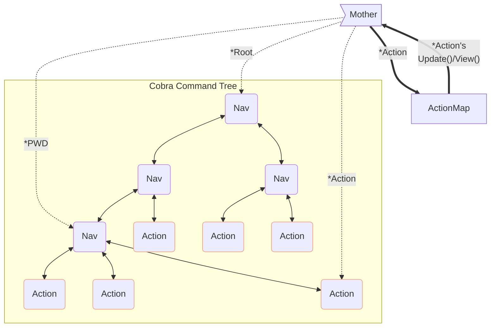
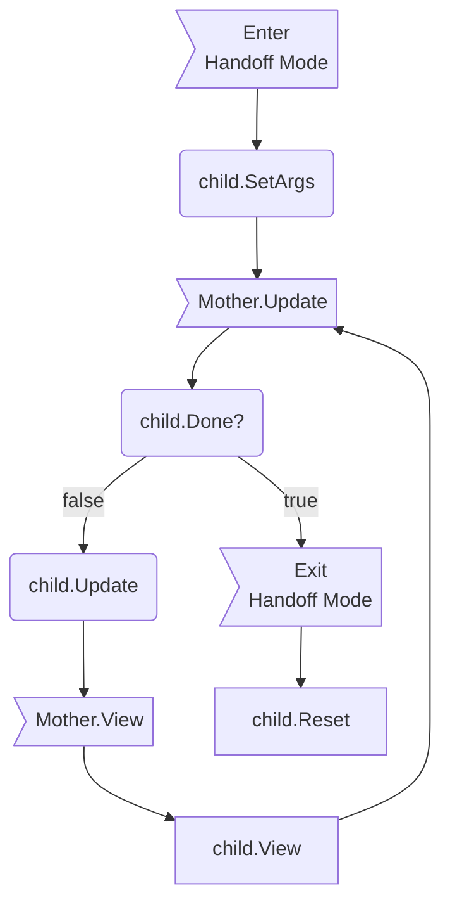

# Overview

In essence, gwcli is a [Cobra](http://cobra.dev) command tree that can be crawled around via our [Bubble Tea](https://github.com/charmbracelet/bubbletea) instance.

gwcli is built to allow more functionality to be easily plugged in; it follows design principles closer to that of a toolbox/ framework. For instance, [list scaffolding](utilities/scaffold/scaffoldlist/list.go) provides complete functionality for listing any kind of data in a unified way while requiring minimal code. The goal is to genericize as much as possible, so future developers can simply call these genericized subroutines. See [Scaffolded](#scaffolded).

# Terminology

Bubble Tea has the `tea.Model` interface that must be implemented by a `model` struct of our own. `Bubbles.TextInput`, along with every other Bubble, is a `tea.Model` under the hood. Cobra is composed of `cobra.Commands` and Bubble Tea drives its I/O via `tea.Cmd`s. CLI invocation is composed of commands, arguments, and flags.

So we are using our own terminology to avoid further homonyms.

Our Bubble Tea model implementation, our controller, is *Mother*.

Tree leaves (commands that can be invoked interactively or from a script), such as `query`, are *Actions*.

Tree nodes (commands that require further input/are submenus), such as `user`, are *Navs*.

# Quick Tips

- Configuration (and thus, defaults) is handled by the [cfgdir](gwcli/utilities/cfgdir/cfgdir.go) package.

- If your action seems to hang until a key is pressed, try returning a `.Blink`. This typically is not necessary, but the TUI only redraws when a messages occurs. If you are only returning nils, but need an update to occur, there will nothing to proc it.

    - Bubble Tea only triggers its cycle when a message comes in. Returning nil when few other messages are being sent can cause the application to *appear* unresponsive when it is instead waiting for another message, thus triggering the anticipated redraw.

- This is a prompt; anything not immediately interactive should be output via `tea.Print*` as history, rather than in the `.View()` that will be lost on redraw. 

- Do not include newlines in lipgloss `.Render()`s. It produces weird results.

- tea.Cmds are like buckets; they can contain one command or many commands in different groupings. Bubble Tea is smart enough to handle it all. As such, it generally does not make sense to pass around arrays of `tea.Cmd`; make the progenitor of the `tea.Cmd`s figure out how it wants to `.Sequence`/`.Batch` them.

    - This lesson took a while to sink in; you may see `[]tea.Cmd` signatures floating around, but these should be replaced, primarily with `.Batch()`s. I already incorporated .Sequence() where important.

    - There are some caveats to this, with BubbleTea not guaranteeing to fully unpack nested sequence and batch commands in proper order ([#847](https://github.com/charmbracelet/bubbletea/issues/847), [#680](https://github.com/charmbracelet/bubbletea/issues/680)).

- Panics should be considered profane. Panicking during setup, however, may be acceptable if the alternative is an entirely broken product (setup errors are likely the dev's fault.)

# Build System

gwcli uses [Mage](magefile.org) as its build system. Explore it by installing mage and calling `mage -h`/`mage -h <cmd>` and see all available commands with `mage -l`.

## Testing

The testing suite for gwcli has three kinds of tests: internal_test.go, noci_test.go, and _test.go.

*internal* tests use the parent package directly, rather than a separate `<parent>_test` package. They should be used to test unexported functions and should be rare.

*noci* tests are tests that require a gravwell instance to hook into, therefore making them unsuitable for use in a CI/CD pipeline (without spinning up a backend). These tests are expected to destructively alter the target instance and are tagged with the "noci" build tag. All tests that do not expect a backend are tagged with "ci" and/or "teatest".

There are also TeaTests, tests that take advantage of Charm's experimental [teatest package](https://github.com/charmbracelet/x/tree/main/exp/teatest) (which you can read about [here](https://charm.land/blog/teatest/)). They are functionally similar to other tests, but with the addition of the `golden` file. Golden files are basically the output of a tea.Model's view put into a file. When the tests are run, a `diff` is executed against the golden file and the test's output. If they match, great. If not, back to work. What this means, however, is that changes made to the visual component of actions that use teatest must have their golden files regenerated. To do this, run go test with the `-update` flag (datascope, for example: `go test ./tree/query/datascope -run ^Test_ -update`). TeaTest also does not play nicely with the `-race` flag. 
    - Ultimately, teatest has limited usefulness over manually testing visual components, particularly as it requires a `tea.Model` which our actions do not implement (Mother does, but child actions implement our `action.Model` instead and typically pass by reference).

The easiest way to test gwcli is to run `mage test:all -server=<host:port>`. All non-teatests are run with `-race`.

# Changing the Command Tree

This section details how to alter and add to the command tree. These are the basic, most common changes. 

## Adding a New Nav (Submenu)

To create a new Nav, use `treeutils.GenerateNav()`. This function takes basic information about the nav and its *immediate* descendants: []*cobra.Command for sub-navs and []action.Pair for sub actions.

Navs are self-building and thus only need to know about their immediate descendants; child navs will handle their own children. See [tree generation](#generation) for more information.

Add your new nav to the `[]*cobra.Command` of whatever nav you want to be its parent.

Adding navs to the root of the tree is similarly easy; root is nothing more than a nav with some extra fluff on it.

See the [queries](tree/queries/queries.go) nav as an example of a nav attached to root (in root.go), with navs and actions under it.

## Adding a New Action

Creating a new action will depend heavily on whether or not you are using a scaffold. **Prefer scaffolds**.

### Scaffolded

Most things people want to do with a cli app fall into one of several buckets. Folks typically want to create data, delete data, edit data, or list data. As such, gwcli has skeletons in place to make creating these types of actions super easy!

These frameworks are known as "scaffolds". Each scaffold package has a header comment describing how to use it. In general, you will create a new package for your action, call `scaffold*.New*Action()`, and then insert the returned action pair into the []action.Pair of the parent's `GenerateNav()` call. The [macro actions](gwcli/tree/macros/macros.go) make good examples for most of the scaffolds.

### Bare

Creating an action from scratch is much more arduous and should only be done if you need functionality outside of the confines of the scaffolds.

You must define two instances: a `*cobra.Command` (via `treeutils.GenerateAction()`) and an `action.Model` (see [action.Model](#actionmodel) below). Use `action.NewPair()` to put these together into an `action.Pair` you can give to the parent nav.

Actions can be invoked in three ways, all of which you must take into account.

1) No Interactive: No Interactive mode occurs when a user calls your action from their shell and sets `-x`. In this mode, actions may not take any further user input and must fail out if data are missing or incorrect. This mode is handled by the `RunE` function you pass to `treeutils.GenerateAction()`.

2) Hybrid/Direct Invocation: Direct Invocation is the same as No Interactive mode, but the user did *not* set `-x`. If data are missing or incomplete, you should call `mother.Spawn()`. The action will be restarted as if it had been called via #3 (Spawn is intelligent enough to initialize Mother on this action).

3) Interactive: Interactive mode is as it sounds on the tin: an action was called via the TUI's prompt (or Hybrid mode and it called Spawn). The action.Model you defined will kick in and process until the user completes/cancels their work or an unrecoverable error occurs.

The [ingest](gwcli/tree/ingest/ingest.go) action and [Basic scaffold](gwcli/utilities/scaffold/basic.go) make pretty good examples.

# Packages

Every effort has been made to document each package/file internally. There is, quite possibly, too much documentation. Here are short descriptors of important packages.

## Clilog

Clilog is the logging apparatus of gwcli. All packages should use its `Writer` singleton for logging.

Stylistically speaking, callees log relevant data only they have access to, but return errors for the caller to log, lest both callee and caller try to log the same error.

## Connection

Connection manages, well, the connection. It is the gateway to the Gravwell Client library. All Gravwell interactions should be made via its exported `Client` singleton.

## Mother

The true workhorse of gwcli, Mother manages *all* interactivity. See [her section below](#mother-the-beating-heart-of-gwcli) for more information.

## Stylesheet

A menagerie package focused on enforcing consistent text, colors, and sigils across the program.

## Tree

The one containing `root.go`, not the one beneath that that contains `tree.go`. Yes, a lot of packages share names. `¯\_(ツ)_/¯`

The actual [command tree](#the-command-tree). This package is organized to be a replica of how the navs and actions are situated inside of gwcli's shell.

## Utilities/Scaffold

Scaffolds are the boilerplate action for rapidly bolting on new functionality that falls under one of their purviews.

## Utilities/Uniques

Uniques contains data and functions that must be shared across packages and do not fit elsewhere. It is crude instrumentation.

# The Command Tree

As mentioned in the Overview, the command tree is ultimately just a cobra.Command tree that Mother crawls around.

## Generation

The command tree is self-building: each nav builds itself and its immediate children. This causes the tree to 'recur' down each branch, building a nav at each node until we hit a nav with only leaves.

Root begins generation as it is just a Nav. Take a look at `Execute()` in root.go; you can see that root is given a series of navs and another series of actions. Diving into one of the `.New*Nav` subroutines shows that it is built in the same way as root: given a series of self-building Navs and a list of actions that can be invoked at that level.

# Mother: The Beating Heart of Gwcli

Cobra does not natively support interactivity, so we need an adapter: Mother.
Mother performs a variety of key tasks: traversing the command tree; associating `cobra.Commands` with their interactive elements (`action.Model`s); handing off to, and reasserting control from, children when they are invoked; printing and managing the historical record of commands; and traversing user input on the prompt.

Navigation is just a couple of pointers; `Mother.root` is the root of the tree and `Mother.pwd` is her current position.

Child actions are held in the Action map singleton implemented in [action.go](action/action.go). Basically, `treeutils.GenerateAction()` registers the `action.Model` and its `cobra.Command` in a hashtable and Mother looks up these `action.Model`s when it is time to invoke them interactively. This isn't necessary when invoked non-interactively (ex: from your shell's command line) because we can just use cobra's `.RunE()`. See [below](#actionmodel) for more information on `action.Model`s.

When a child action is being interacted with, Mother runs in "handoff" mode. When her `.Update()` is called, it quickly passes control to the child action's `.Update()`. Same for `.View()`. Note, however, that we never call a child's `.Update()` without `Mother.Update()` calling it. This allows Mother to check for kill keys and the child's `.Done()` first so she knows if she must reassert control instead of passing to the child.

History is handled by `history.go` in the `mother` package and is fairly straightforward. Go check it out if you are interested, but it is functionally complete until someone tackles persistent history.

Input parsing, for when a Mother is in control, is managed by `processInput()`. The heavy lifter here is the [`Walk()` subroutine](gwcli/utilities/uniques/uniques.go), which recursively walks a string and decides what the user meant by it.

## action.Model

Actions must satisfy the `action.Model` interface to be able to supplant Mother as the controller. This means satisfying all 5 methods: `Update()`, `View()`, `Done()`, `Reset()`, and `SetArgs()`.

`SetArgs(fs *pflag.FlagSet, tokens []string, width, height int) (invalid string, onStart tea.Cmd, err error)` sets fields in the child that manipulate its next run. It is called when Mother *first enters handoff mode* for a child, before the child's first `Update()`. It provides the flagset this action inherited from its ancestors (typically just persistent/global flags like `--no-interactive`) as well as all tokens remaining *after* the action invocation. The former is likely to be unused (but provided just in case) and the latter is pre-shlex'd so it can be fed into your local flagset's `.Parse()`. Last-known available width and height are also provided. 

It returns, respectively: the reason this argument set is invalid (or ""), tea.Cmds the child needs run on startup (eg: right now), errors outside of the users control. The startup Cmd somewhat takes the place of `tea.Model.Init()`.

`Update(tea.Msg) tea.Cmd` is the primary driver of the action. While in handoff mode, Mother will invoke the child's `Update()` subroutine in place of her own.

`View() string`, like Update, supplants Mother's View method while in handoff mode. Note, however, that views are ephemeral: redraws clobber prior views.

`Done() bool` is called by mother *before handing off* each cycle. If it is true, Mother will *not* hand off and will instead reassert control, unseating the child. Generally tracked by a private variable in the child struct.

`Reset() error` is called by Mother *after* Mother reasserts control (exiting handoff mode). This typically occurs after `Done()` returns true or the user pressed a child-only kill key (like `esc`). It resets the child to a clean state so it can be called again later.

## Custom Suggestion and Tab-Completion Engine

To improve the flexibility and power of completions in interactive mode, gwcli uses a custom engine for identifying what a user is attempting to type at the prompt.
This engine is powered by `traverse.DeriveSuggestions()` and triggered whenever a key press is detected in Mother's `Update()` subroutine. See [DeriveSuggestions](gwcli/mother/traverse/traverse.go) for more details on how it operates.

### Why?

Bubble Tea's TextInput bubbles are great and their native suggestions and tab completion are plenty for most projects. However, gwcli stretches BubbleTea quite far. To facilitate performant suggestions with type-specific colorings, context-sensitive completions, and the possibility of adding flag completions, it makes more sense to roll our own rather than trying to bend the native capabilities to our will.

# Design & Philosophy

This section is a deep dive on the design philosophy and problems that arose while building gwcli from scratch. You probably don't need to read this section unless you intend to make more dramatic changes to the structure of Mother/gwcli.

## Cobra/Bubble Tea Interoperability

We want to rely on Cobra+pflag as much as possible; Cobra has all the navigational features we need and the further we stray from the pair, the less we benefit from their auto-generation capabilities.

However, Mother cannot hand off control to a cobra.Command leaf (an *Action*) because it does not have `.Update()` and `.View()` methods to supplant her own. We cannot add methods to non-local structs.

With Type Embedding, an Action struct could embed cobra.Command and implement `.Update()` and `.View()` (basically: `class Action extends cobra.Command implements tea.Model` in OOP parlance). That way, it has all the subroutines Cobra will invoke in non-interactive mode and the several we need when driving Bubble Tea.

Solved, right? Not quite. The relationship must be bi-directional, which is not feasible.

Clock this signature `.AddCommand(cmds ...*cobra.Command)`. To get commands into Cobra's tree so it can work its magic, we need to supply a cobra.Command *struct*. Due to the way Go's quasi-inheritance works, we cannot masquerade our Action 'super' type as its 'base'. 

We have several options:

1) We use a super wrapper and cast back and forth between our super and `cobra.Command` (as is done for the list bubble used by Bubble Tea). Workable, but will chafe against Go's preferred paradigm.

2) Maintain two, separate-but-topologically-identical trees using two different structures. We retain the normal `cobra.Command` tree and a parallel tree for Mother to operate on. This decouples Cobra and Mother, allowing them total flexibility in data representation, but could lead to significant data duplication and difficulty guaranteeing equity when adding new commands or performing maintenance. Given Cobra provides all required data for navigation and Nav nodes, this feels a bit like reinventing the wheel just to tack on a couple methods for the tree's leaves.

3) Maintain a data structure of Actions within Mother so we can look up subroutines associated to it when called. This keeps Cobra and Mother paired and allows us to continue leveraging Cobra's tree directly without maintaining a parallel tree. On the other hand, it separates Actions from their subroutines somewhat significantly and would require care to ensure equity, similar to the parallel trees of option #2. 

4) Fork Cobra, attach the required function signatures (ex: `.Update()`, `.View()`, ...) to the Cobra struct directly (or convert the cobra struct to an interface), and include the fork as a submodule. This is the most straightforward and lowest-initial-lift option. We can navigate and act *entirely* off the cobra.Command tree, supplanting Mother's Model-Update-View with that of the selected Action's stored directly inside the Action's command. However, we now how two packages to maintain, instead of just one.

Option 3 is how interoperability was designed. Mother/interactive mode can function entirely off Cobra's navigation and Cobra can operate entirely as normal. The only adaptation takes place in interactive mode, when an action is invoked; Mother uses the cobra.Command to fetch the interactive methods from the action map that should supplant her standard model.

## Singletons

Outside of a game design context, globals (and singletons) are generally a smell.

That being said, the program must be usable from any number of different entry-points and scenarios; it does not have a central "app" struct or similar for hosting widely-shared resources. Cobra and Mother need access to similar resources, without being able to assume who owns or has utilized what. Thus, self-initializing singletons make some sense in case.

Tangentially, a singleton is trivial to enforce locks on, especially in software with flexibility in coarseness of locking.