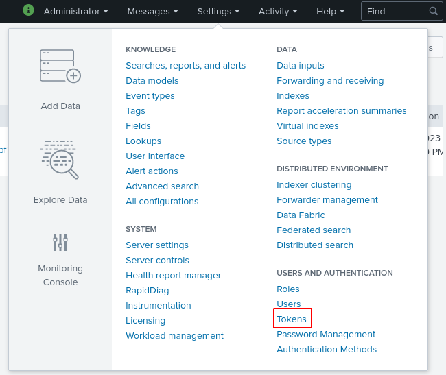
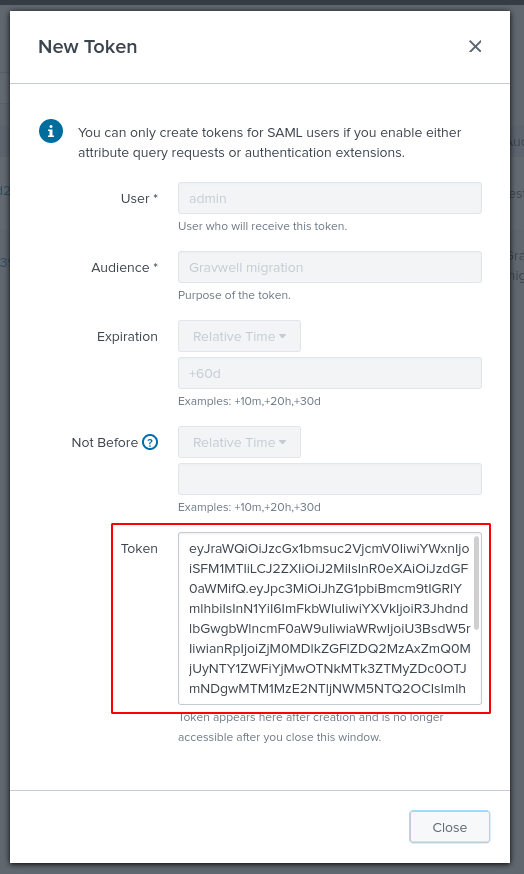
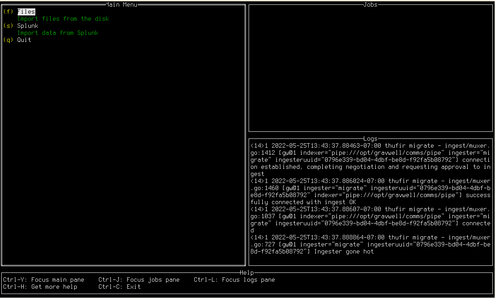
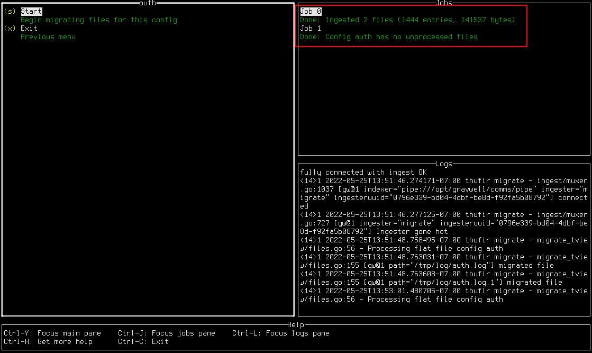
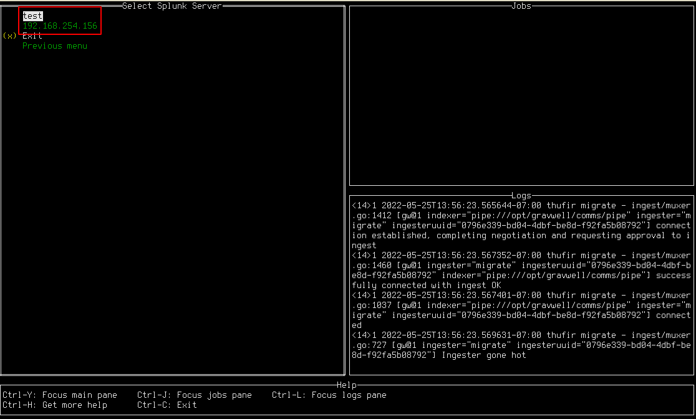
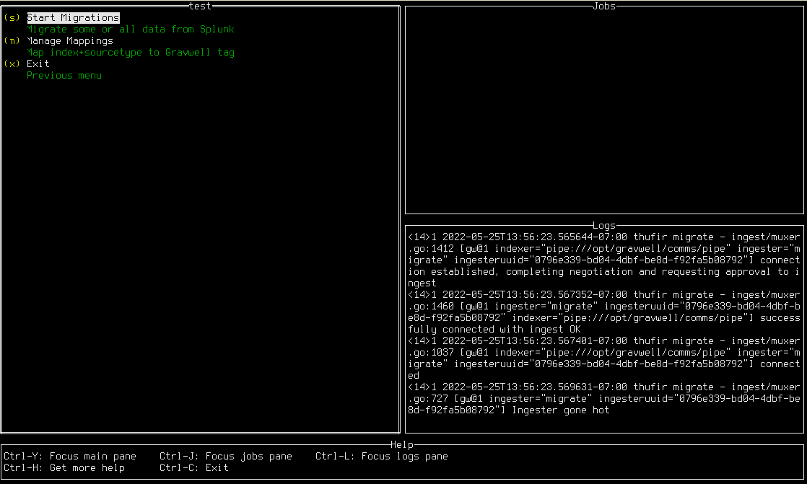
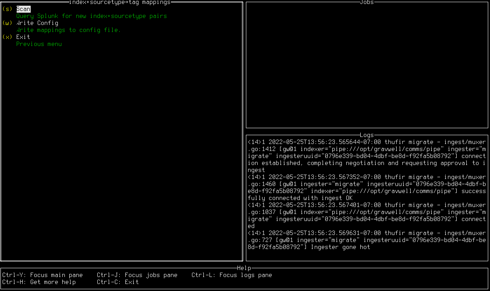
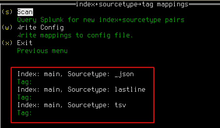
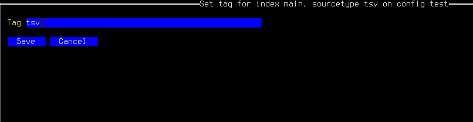
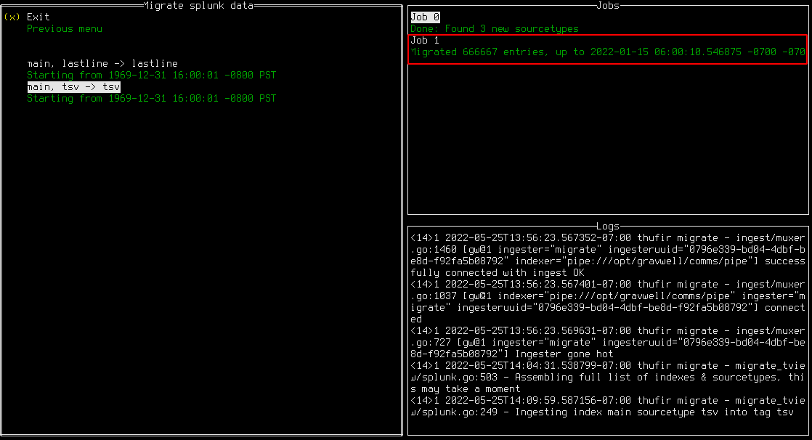

---
title:  "The Gravwell Migration Tool"
keywords: [gravwell, migration, splunk]
...

Gravwell provides an interactive tool for migrating text files and Splunk data into Gravwell. This document describes how to install, configure, and use it.

# Installation

At this time, the migration tool is provided as a statically-linked Linux binary. No specific installation is required.

# Initial Configuration {#sec:config}

The migration tool stores its configuration in two different places:

* A top-level config file, usually named `migrate.conf`.
* A config directory, often named `migrate.conf.d`, which contains automatically-generated config snippets stored by the program.

As a user, you should only need to modify `migrate.conf`. The following is a simple configuration which migrates data from both Splunk and from files on disk:

```
[Global]
Ingester-UUID="0796e339-bd04-4dbf-be8d-f92fa5b08792"
Ingest-Secret = IngestSecrets
Connection-Timeout = 0
Insecure-Skip-TLS-Verify=false
Cleartext-Backend-Target=192.168.1.50:4023
State-Store-Location=/tmp/migrate.state
Log-Level=INFO
Log-File=/tmp/migrate.log

[Splunk "splunk1"]
	Token=`eyJraWQiOj[...]nlHnn4Oivew`
	Server=splunk.example.org

[Files "auth"]
	Base-Directory="/var/log"
	File-Filter="auth.log,auth.log.[0-9]"
	Tag-Name=auth
	Recursive=true
	Ignore-Line-Prefix="#"
	Ignore-Line-Prefix="//"
	Timezone-Override="UTC" #force the timezone
```

It specifies:

* Data should be ingested to the Gravwell indexer at `192.168.1.50:4023`, using `IngestSecrets` as the token to authenticate with Gravwell.
* There is a Splunk server at `splunk.example.org` which can be accessed using the given token (the token has been shortened for this document).
* It should pull `auth.log`, `auth.log.1`, `auth.log.2` and so on from `/var/log` and ingest each line as an entry, using the Gravwell tag "auth".

## Configuring Splunk: Tokens

In order to fetch data from a Splunk server, you must generate an authentication token which the migration tool can use to communicate with Splunk. Tokens may be generated in the Splunk UI under Settings > Tokens, as seen in Figure @fig:tokensmenu.

{#fig:tokensmenu}

On the Tokens page, click the `New Token` button, then fill in the "Audience" field with something like "Gravwell migration", select a token expiration time if desired (+60d is a good choice), and click `Create`. The UI will then display a token in the "Token" field as seen in Figure @fig:newtoken; copy this and save it somewhere, because it cannot be retrieved later!

{#fig:newtoken}

This token string should be inserted into the `Token` field of a Splunk configuration block in the main config file. The `Server` field should correspond to whatever IP address or hostname you use to access your Splunk server.

\clearpage

# Using the Tool

To start the tool, run the provided binary with the `-config-file` parameter pointing at your main config file, and `-config-overlays` pointing at a directory you wish to use for configuration snippets:

```
./migrateTUI -config-file migrate.conf -config-overlays migrate.conf.d
```

If the configuration is valid, you should see the main menu of the migrate tool (Figure @fig:migrate-ui). The UI displays several panes of information: the main menu where you select actions, the "Jobs" pane where running migrations are tracked, the "Logs" pane where debugging information is displayed, and the "Help" pane which shows some basic key combinations.

{#fig:migrate-ui}

## Migrating Files

Importing files from the disk is quite simple. First, set up the configuration file (Section @sec:config) to point at files on the disk you're interested in ingesting. Then, from the main menu, select the "Files" option. You should see a list of all the `Files` config blogs you defined. For instance, given the following configuration block, you should see a menu which resembles Figure @fig:filemenu.

```
[Files "auth"]
	Base-Directory="/tmp/log"
	File-Filter="auth.log,auth.log.[0-9]"
	Tag-Name=auth2
	Ignore-Timestamps=true #do not ignore timestamps
	Recursive=true
```

{#fig:filemenu}

Selecting "auth" opens another menu, where the migration can be launched. To begin the migration, press the `s` key or select the "Start" option. As seen in Figure @fig:filejob, a job will appear in the Jobs pane showing the migration progress. In this case, there were 2 files ingested, for a total of 1444 entries and 141537 bytes of data. 

{#fig:filejob}

Note that there are actually two jobs shown in the screenshot. After the first migration job completed, "Start" was selected again. However, the migration tool tracks how much of each file it has ingested, so it will not duplicate data; the second job simply noted that there was no new data to ingest and exited.

\clearpage

## Migrating Splunk Data

To import data from Splunk, make sure you have configured at least one `Splunk` block in the config file (Section @sec:config), then select "Splunk" from the main menu. This will open a new menu (Figure @fig:splunkserver) in which you can select which Splunk server to migrate from.

{#fig:splunkserver}

Once a server has been selected, you will see the server's menu as seen in Figure @fig:splunkservermenu. 

{#fig:splunkservermenu}

### Mapping index+sourcetype to tag

You must now define how Splunk's data organization should be mapped to Gravwell. In Splunk, data is organized into indexes and sourcetypes. In Gravwell, data simply receives a tag. To define these mappings, select "Manage Mappings"; this will open the mapping screen, seen in Figure @fig:splunkmappings.

{#fig:splunkmappings}

Initially, the tool is not aware of which indexes and sourcetypes exist on the Splunk server. Select "Scan" to connect to the Splunk server and query this information; this may take a few seconds. Once the scan is complete, several index+sourcetype pairs should be visible, each with a blank tag, as seen in Figure @fig:sourcetypes.

{#fig:sourcetypes}

Select a pair which you wish to import and press enter. A form (Figure @fig:tagform) will be displayed in which you may enter the Gravwell tag to be used; note that it will only allow you to type valid tag characters.

{#fig:tagform}

After you have set the tag for the desired index + sourcetype pairs, you can select "Write Config" to write out a file in the `migrate.conf.d` directory which will store the mappings permanently.

### Starting Migrations

Having defined mappings from Splunk index+sourcetype to Gravwell tag, you may now launch migration jobs. From the server menu, select "Start Migrations". A menu will appear showing the index+sourcetype → tag mappings you defined earlier. Selecting one of these mappings will start a migration job, as seen in Figure @fig:migratejobs.

{#fig:migratejobs}

You can launch multiple migrations at once. Note that Splunk migrations may take a while; if you exit the migrate tool while a Splunk migration is running, the job will be halted as soon as possible and the most recent timestamp will be stored to resume later--we make every effort to avoid data duplication!
