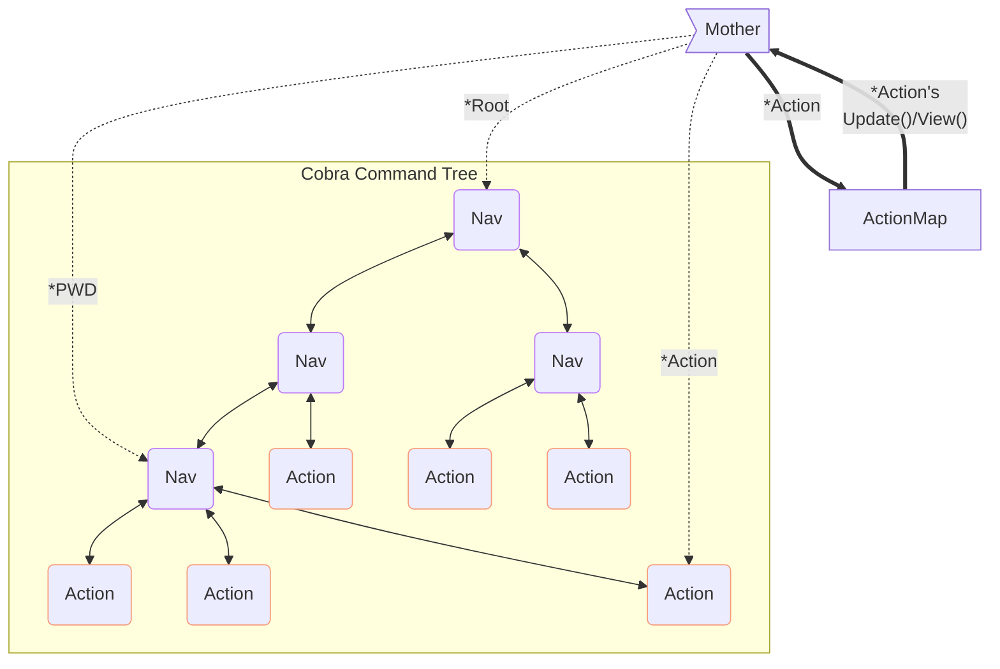
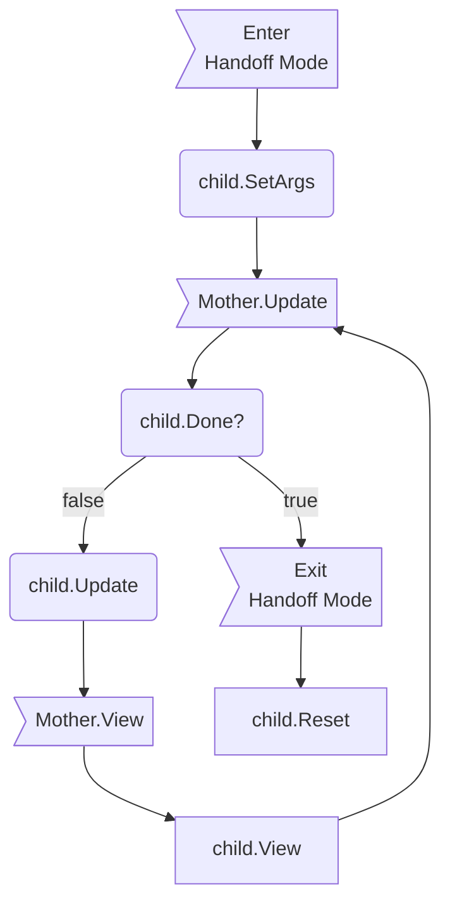

# Overview

In essence, gwcli is a [Cobra](http://cobra.dev) command tree that can be crawled around via our [Bubble Tea](https://github.com/charmbracelet/bubbletea) instance. As such, you should understand the [Elm Architecture](https://guide.elm-lang.org/architecture/) before continuing. Don't worry, it is really simple.

gwcli is built to allow more functionality to be easily plugged in; it follows design principles closer to that of a toolbox or framework. For instance, [list scaffolding](utilities/scaffold/scaffoldlist/list.go) provides complete functionality for listing any kind of data in a unified way while requiring minimal new code. The goal is to genericize as much as possible, so future developers can simply call these genericized subroutines.

# Terminology

Bubble Tea has the `tea.Model` interface that must be implemented by a model struct of our own. Bubbles.TextInput, along with every other Bubble, is a tea.Model under the hood. Cobra is composed of `cobra.Commands` and Bubble Tea drives its I/O via `tea.Cmd`s. CLI invocation is composed of commands, arguments, and flags.

So we are using our own terminology to avoid further homonyms.

Our Bubble Tea model implementation, our controller, is *Mother*.

Tree leaves (commands that can be invoked interactively or from a script), such as `query`, are *Actions*.

Tree nodes (commands that require further input/are submenus), such as `user`, are *Navs*.

# Quick Tips

- Actions' Update subroutines should **always** return a tea.Cmd when handing control back to Mother.

    - If you do not have anything to `tea.Println()` on completion, use a `.Blink` method

    - This is to prevent faux-hanging. Bubble Tea only triggers its cycle when a message comes in. Returning nil when few other messages are being sent can cause the application to appear unresponsive when it is instead waiting for another message, thus triggering the anticipated redraw.

- This is a prompt; anything not immediately interactive should be output via `tea.Print*` as history, rather than in the `.View()` that will be lost on redraw. 

- Do not include newlines in lipgloss renders. It produces weird results.

- tea.Cmds are like buckets; they can contain one command or many commands in different groupings. Bubble Tea is smart enough to handle it all. As such, it generally does not make sense to pass around arrays of `tea.Cmd`; make the progenitor of the `tea.Cmd`s figure out how it wants to `.Sequence`/`.Batch` them.

    - This lesson took a while to sink in; you may see `[]tea.Cmd` signatures floating around, but these should be replaced, primarily with `.Batch()`s. I already incorporated .Sequence() where important.

# Changing the Command Tree

This section details how to alter and add to the command tree. These are the basic, most common changes. 

## Adding a New Nav (Submenu)

To create a new Nav, use `treeutils.GenerateNav()`. This function takes basic information about the nav as well as its *immediate* descendants: []*cobra.Command for sub-navs and []action.Pair for sub actions.

Navs are self-building and thus only need to know about their immediate descendants; child navs will handle their own children. See [tree generation](#generation) for more information.

Navs generally get their own package so the package tree equates to the command tree, but there is no hard requirement for this.

Add your new nav to the `[]*cobra.Command` of whatever nav you want to be its parent.

Adding navs to the root of the tree is similarly easy; root is nothing more than a nav with some extra fluff on it.

See the [queries](tree/queries/queries.go) nav as an example of a nav attached to root (in root.go), with navs and actions under it.

## Adding a New Action

Creating a new action will depend heavily on whether or not you are using a scaffold. **Prefer scaffolds**.

### Scaffolded

These are pre-generated actions (list, edit, create, delete, or basic (perform one thing that does not require further interaction)) that can be tweaked for specific use-cases.

Each scaffold package has a header comment describing how to use it. In general, you will create a new package for your action, call `scaffold*.New*Action()`, and then insert the returned action pair into the []action.Pair of the parent's `GenerateNav()` call. The [macro list](tree/macros/list/list.go) action is a good example.

### Bare

Creating an action from scratch is much more arduous and should only be done if you need functionality outside of the confines of the scaffolds.

You will still have a `New*Action() action.Pair` function that can be given to the parent nav. In here, define your cobra.Command via `treeutils.NewActionCommand()` and `treeutils.GenerateAction()`.

Your action must be able to handle three, primary user modes: script mode, interactive run mode, and interactive (Mother) mode.
Script mode and interactive run mode are handled in your cobra.Command runFunc; the user invokes this action directly from their shell, with or without --script.
Interactive (Mother) mode requires you to create a new implementation of `action.Model` (see [below](#actionmodel)). This new struct will be given to `GenerateAction()`, returning you the `action.Pair` needed to attach this action to a nav.

The Basic scaffold is a highly simplistic implementation of an action. For a much more in-depth example, take a look at [query.go](tree/query/query.go). This showcases an entirely manual implementation of an action, from creating the runFunc and branching it on --script to spawning a totally new action.Model and shifting it between different modes.

# Packages

Every effort has been made to document each package/file internally. There is, quite possibly, too much documentation. Here is a short list of the most important packages.

## Clilog

Clilog is the logging apparatus of gwcli. All packages should use its `Writer` singleton for logging.

Stylistically speaking, callees log relevant data only they have access to, but return errors for the caller to log, lest both callee and caller try to log the same error.

*Please note*: Most errors should be recoverable while in interactive mode and therefore panics are profane (panic/recover is slow as hell). However, panicking during setup is perfectly acceptable; errors during setup are almost certainly developer error, therefore the earlier they arise the better.

## Connection

Connection manages, well, the connection. It is the gateway to the Gravwell Client library. All Gravwell interactions should be made via its exported `Client` singleton.

## Mother

The true workhorse of gwcli, Mother manages *all* interactivity. See [her section below](#mother-the-beating-heart-of-gwcli) for more information.

## Stylesheet

A menagerie package focused on enforcing consistent text and colors across the program. Admittedly, its organization is imperfect and has become some degree of a catch-all.
The intention is for this to eventually be supplant-able for custom styling.

## Tree

The one containing `root.go`, not the one beneath that that contains `tree.go`. Yes, a lot of packages share names. `¯\_(ツ)_/¯`

The actual command tree. This package is organized to be a replica of how the navs and actions are situated inside of gwcli's shell.


## Utilities/Scaffold

Scaffolds are the boilerplate action for rapidly bolting on new functionality that falls under one of their purviews.

## Utilities/Uniques

Uniques contains data and functions that must be shared across packages and do not fit anywhere else. Like Stylesheet, it is crude instrumentation.

# The Command Tree

As mentioned in the Overview, the command tree is ultimately just a cobra.Command tree that Mother crawls around.

## Generation

The command tree is self-building: each nav builds itself and its immediate children. This causes the tree to 'recur' down each branch, building a nav at each node until we hit a nav with only leaves.

Root begins generation as it is just a Nav. Take a look at `Execute()` in root.go; you can see that root is given a series of `.New*Nav` and `.New*Action`. Diving into one of the `.New*Nav` subroutines shows that it is built in the same way as root: given a series of self-building Navs and a list of actions that can be invoked at that level.

# Mother: The Beating Heart of Gwcli

Cobra does not natively support interactivity, so we need an adapter of some kind: Mother.
Mother performs a variety of key tasks: traversing the command tree; associating `cobra.Commands` with their interactive elements (`action.Model`s); handing off to, and reasserting control from, children when they are invoked; printing and managing the historical record of commands, and parsing user input on the prompt.



Navigation is just a couple of pointers; `Mother.root` is the root of the tree and `Mother.pwd` is she current position.

Child actions are held in the Action map implemented in [action.go](action/action.go). Basically, `treeutils.GenerateAction()` registers the `action.Model` and its `cobra.Command` in a hashtable and Mother looks up these `action.Model`s when it is time to invoke them interactively. This isn't necessary when invoked non-interactively (ex: from your shell's command line) because we can just use cobra's `.run()`. See [below](#actionmodel) for more information on `action.Model`s.

When a child action is being interacted with, it is considered "in control". Instead of running her usual prompt management in `.Update()`, Mother passes control to the child action's `.Update()`. Same for `.View()`. Note, however, that we never call a child's `.Update()` without `Mother.Update()` calling it. This allows Mother to check for kill keys and the child's `.Done()` first so she knows if she must reassert control. instead of passing to the child.

History is handled by `history.go` in the `mother` package and is fairly straightforward. Go check it out if you are interested, but it is functionally complete.

Input parsing, for when a Mother is in control, is managed by `processInput()`. The heavy lifter here is the `walk()` subroutine, which recursively walks a string and decides what the user meant by it. I am pretty proud of it, go take a look in [walk.go](mother/walk.go).

## action.Model

Actions must satisfy the `action.Model` interface to be able to supplant Mother as the controller. This means satisfying all 5 methods: `Update(), View(), Done(), Reset(), and SetArgs()`.

`Update(tea.Msg) tea.Cmd` is the primary driver of the action. While in handoff mode, Mother will invoke the child's `Update()` subroutine in place of her own.

`View() string`, like Update, supplants Mother's View method while in handoff mode. Note, however, that this is a prompt and all non-interactive output should instead be printed outside of Bubble Tea's control (via `tea.Print*()`).

`Done() bool` is called by mother *before handing off* each cycle. If it is true, Mother will *not* hand off and will instead reassert control and unseat the child. Generally tracked by a private variable in the child struct.

`Reset() error` is called by Mother *after* `Done()` returns true. It resets the child to a clean state so it can be called again later.

`SetArgs(*pflag.FlagSet, []string) (string, []tea.Cmd, error)` sets fields in the child that manipulate its next run. It is called when Mother *first enters handoff mode* for a child. It provides the flagset this action inherited from its ancestors as well as all tokens remaining *after* the action invocation. The former is likely to be unused (but provided just in case) and the latter is pre-split by shlex (shell-splitting rules).
It returns, respectively: the reason this argument set is invalid (or ""), tea.Cmds the child needs run on startup (eg: right now), errors outside of the users control. The startup Cmd somewhat takes the place of `tea.Model.Init()`.



# Design & Philosophy

This section is a deep dive on the design philosophy and problems that arose while building gwcli from scratch. You probably don't need to read this section unless you intend to make more dramatic changes to the structure of Mother/gwcli.

## Cobra/Bubble Tea Interoperability

We want to rely on Cobra as much as possible; it has all the navigational features we need and the further we stray from it, the less we benefit from its auto-generation capabilities.

However, Mother cannot hand off control to a cobra.Command leaf (an *Action*) because it does not have `.Update()` and `.View()` methods to supplant her own. We cannot add methods to non-local structs.

With Type Embedding, an Action struct could embed cobra.Command and implement `.Update()` and `.View()` (basically: `class Action extends cobra.Command implements tea.Model` in OOP parlance). That way, it has all the subroutines Cobra will invoke in non-interactive mode and the several we need when driving Bubble Tea.

Solved, right? Not quite. The relationship must be bi-directional, which is not feasible.

Clock this signature `.AddCommand(cmds ...*cobra.Command)`. To get commands into Cobra's tree so it can work its magic, we need to supply a cobra.Command *struct*. Due to the way Go's quasi-inheritance works, we cannot masquerade our Action 'super' type as its 'base'. 

We can supply cobra with a pointer to the embedded type: 

ex: 

```go
a := &action.Model{Command: cobra.Command{}}

// ...
// bolt on the subroutines required for action.Model
// ...

root.AddCommand(a.Command)
```

This, however, will dispose of our super wrapper `a` as soon as it falls out of scope.

We have several options:

1) We use the above super wrapper and cast back and forth between our super and `cobra.Command` (as is done for the list bubble used by Bubble Tea). If this were C, I'd be perfectly happy with this solution as I have a pretty good understanding of what the underlying memory will look like. However, this is Go and the quasi-casting Go provides is 1) hardly idiomatic and 2) less clear on what the garbage collector will do with the underlying memory. This solution may work fine, but will likely chafe against the language.

2) Maintain two, separate-but-topologically-identical trees using two different structures. We retain the normal `cobra.Command` tree and a parallel tree for Mother to operate on. This decouples Cobra and Mother, allowing them total flexibility in data representation, but could lead to significant data duplication and difficulty guaranteeing equity when adding new commands or performing maintenance. Given Cobra provides all required data for navigation and Nav nodes, this feels a bit like reinventing the wheel just to tack on a couple methods for the tree's leaves.

3) Maintain a data structure of Actions within Mother so we can look up subroutines associated to it when called. This keeps Cobra and Mother paired and allows us to continue leveraging Cobra's tree directly without maintaining a parallel tree. On the other hand, it separates Actions from their subroutines somewhat significantly and would require care to ensure equity, similar to the parallel trees of option #2. 

4) Fork Cobra, attach the required function signatures (ex: `.Update()`, `.View()`, ...) to the Cobra struct directly (or convert the cobra struct to an interface), and include the fork as a submodule. This is the most straightforward and lowest-initial-lift option. We can navigate and act *entirely* off the cobra.Command tree, supplanting Mother's Model-Update-View with that of the selected Action's stored directly inside the Action's command. However, we now how two packages to maintain, instead of just one.

While Option 4 is the most straightforward initially, future maintainers may not agree, especially as changes occur to the upstream Cobra package. Therefore, option 3 is how interoperability is designed. Mother/interactive mode can function entirely off Cobra's navigation and Cobra can operate entirely as normal. The only adaptation takes place in interactive mode, when an action is invoked; Mother uses the cobra.Command to fetch the interactive methods from the action map that should supplant her standard model.

## Singletons

Outside of a game design context, globals (and singletons) are generally a bad sign. This is doubly true in C (especially if we consider reentrants).

That being said, the program must be usable from any number of different entry-points and scenarios; it does not have a central "app" struct or similar for hosting widely-shared resources. Cobra and Mother need access to similar resources, without being able to assume who owns or has utilized what. Thus, self-initializing singletons make some sense in case.

Tangentially, while there are no current plans to implement threading, a singleton is trivial to enforce locks on, especially in software with flexibility in coarseness of locking.

## Local Versus Persistent Flags

There are a number of flags that are useful and functionally identically across a number of actions (output, append, CSV/JSON, ...). Therefore, we could make them persistent. However, they do not make sense for some actions, particularly basic actions.

As such, I am not including these common flags as persistents at root level, lest it require every action to support tangential flags. Instead, common elements of these flags are stored in the flagtext package, to at least provide some degree of consistency across flags that are technically unrelated.

Other flags, such as --script, must be supported by all actions anyways, so they are persistent at a root level.